# Architecture Overview

This document provides a comprehensive view of the FuncNodes system architecture, explaining how components interact and data flows through the system.

---

## System Architecture

```mermaid
flowchart TB
    subgraph USER["👤 USER LAYER"]
        Browser["🌐 Web Browser"]
        subgraph Frontend["React Flow UI"]
            Editor["Visual workflow editor"]
            LibBrowser["Node library browser"]
            Preview["Live data previews"]
        end
    end

    subgraph SERVICE["⚙️ SERVICE LAYER"]
        Static["Static File Server<br/>localhost:8000"]
        subgraph WM["Workermanager"]
            WMLife["Worker lifecycle mgmt"]
            WMHub["WebSocket hub :9380"]
            WMDisc["Worker discovery"]
            WMVenv["Venv provisioning"]
        end
    end

    subgraph WORKER["🔧 WORKER LAYER"]
        subgraph Pool["Worker Pool"]
            subgraph W1["Worker 1 :9382"]
                NS1["Nodespace"]
                Lib1["Library"]
                Venv1[".venv"]
            end
            subgraph W2["Worker 2 :9383"]
                NS2["Nodespace"]
                Lib2["Library"]
                Venv2[".venv"]
            end
            subgraph WN["Worker N :938X"]
                NSN["Nodespace"]
                LibN["Library"]
                VenvN[".venv"]
            end
        end
    end

    subgraph STORAGE["💾 STORAGE LAYER"]
        Config["~/.funcnodes/config.json"]
        subgraph Workers["workers/"]
            WConf["worker_uuid.json"]
            WPid["worker_uuid.p"]
            subgraph WDir["worker_name/"]
                WVenv[".venv/"]
                WNS["nodespace.json"]
                WFiles["files/"]
                WLog["worker.log"]
            end
        end
    end

    Browser -->|WebSocket| WM
    WM -->|spawn/manage| Pool
    W1 --> Workers
    W2 --> Workers
    WN --> Workers
```



---

## Component Overview

### Frontend (`funcnodes_react_flow`)

The browser-based visual editor built with React and React Flow:

| Component             | Purpose                                       |
| --------------------- | --------------------------------------------- |
| **Graph Editor**      | Drag-and-drop node canvas                     |
| **Library Browser**   | Browse and search available nodes             |
| **Property Panel**    | Edit node inputs and view outputs             |
| **Worker Selector**   | Manage and switch between workers             |
| **Preview Renderers** | Display data previews (images, plots, tables) |

The frontend connects to both the Workermanager (for worker discovery) and individual workers (for graph manipulation).

### Workermanager

A lightweight `aiohttp` service that supervises workers:

- **Discovery**: Lists available workers and their status
- **Lifecycle**: Creates, starts, stops, and deletes workers
- **Provisioning**: Sets up virtualenvs for new workers
- **Hub**: Routes UI connections to the correct worker

Default endpoint: `ws://localhost:9380/`

### Workers

Independent processes that execute node graphs:

- **Nodespace**: In-memory graph state with nodes and edges
- **Library**: Registry of available node classes (shelves)
- **Event Loop**: Async execution engine for node triggering
- **RPC Server**: WebSocket API for graph manipulation
- **Virtualenv**: Isolated Python environment per worker

Each worker runs on its own port (9382+) and can have different installed modules.

### Storage

File-based persistence in `~/.funcnodes/`:

| File                 | Content                                             |
| -------------------- | --------------------------------------------------- |
| `config.json`        | Global settings (ports, logging, render options)    |
| `worker_<uuid>.json` | Worker configuration (port, env path, dependencies) |
| `nodespace.json`     | Serialized graph (nodes, edges, groups, properties) |

---

## Data Flow

### 1. Startup Sequence

```mermaid
flowchart TD
    Start["User runs: funcnodes runserver"]

    subgraph Init["Initialization"]
        S1["1. Load global config"]
        S2["2. Start static file server"]
        S3["3. Check for Workermanager"]
        S4["Start if not running"]
        S5["4. Open browser to UI"]
    end

    subgraph Connect["UI Connection"]
        C1["UI connects to Workermanager<br/>via WebSocket"]
        C2["• Request worker list<br/>• Subscribe to status"]
    end

    subgraph Worker["Worker Setup"]
        W1["User selects/creates worker"]
        W2["Workermanager spawns<br/>worker process"]
        W3["Worker initializes<br/>nodespace + library"]
        W4["UI connects to worker"]
    end

    Start --> S1 --> S2 --> S3 --> S4 --> S5
    S5 --> C1 --> C2
    C2 --> W1 --> W2 --> W3 --> W4
```



### 2. Node Execution Flow


### 3. Module Loading Flow


---

## Package Structure

FuncNodes is split into several packages:

```
funcnodes (meta-package)
├── funcnodes_core          # Core runtime
│   ├── node.py             # Node, NodeInput, NodeOutput
│   ├── nodeio.py           # IO base class
│   ├── nodespace.py        # Graph container
│   ├── lib.py              # Library, Shelf
│   ├── config.py           # Configuration management
│   └── utils/              # Serialization, functions
│
├── funcnodes_worker        # Worker runtime
│   ├── worker.py           # WSWorker class
│   ├── websocket.py        # RPC server
│   └── loop.py             # Event loops
│
└── funcnodes (package)     # High-level API
    ├── __init__.py         # Public exports
    └── _setup.py           # Module discovery
```

---

## Communication Protocols

### WebSocket Messages

All communication uses JSON over WebSocket:

```json
// Client → Server (Command)
{
  "type": "cmd",
  "cmd": "update_node",
  "kwargs": {
    "uuid": "node-123",
    "input_id": "value",
    "value": 42
  }
}

// Server → Client (Response)
{
  "type": "result",
  "cmd": "update_node",
  "result": { "success": true }
}

// Server → Client (Event)
{
  "type": "nodespaceevent",
  "event": "node_triggered",
  "data": { "uuid": "node-123" }
}
```

See [Message Protocol](message-protocol.md) for the complete reference.

---

## Key Design Decisions

### Why Isolated Workers?

1. **Dependency Isolation**: Different workflows can use different library versions
2. **Crash Isolation**: A buggy node won't take down other workflows
3. **Resource Management**: Workers can be stopped independently
4. **State Isolation**: Each workflow has its own persistent state

### Why Event-Driven?

1. **Reactive**: Data changes automatically propagate
2. **Efficient**: Only affected nodes re-execute
3. **Intuitive**: Matches mental model of data flowing through pipes
4. **Debuggable**: Each step is observable

### Why WebSocket?

1. **Bidirectional**: Server can push updates to clients
2. **Real-time**: Low latency for live previews
3. **Persistent**: No reconnection overhead per message
4. **Standard**: Wide library support

---

## See Also

- [Core Components](core-components.md) — `funcnodes_core` internals
- [Worker Components](worker-components.md) — `funcnodes_worker` internals
- [Message Protocol](message-protocol.md) — RPC command reference
- [Event System](event-system.md) — Event types and handling
