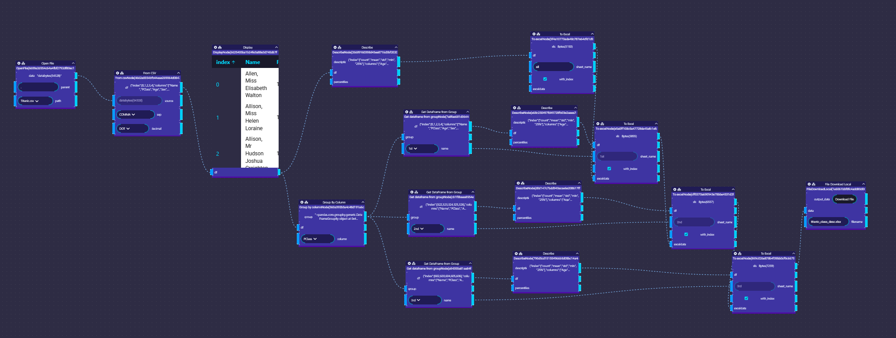
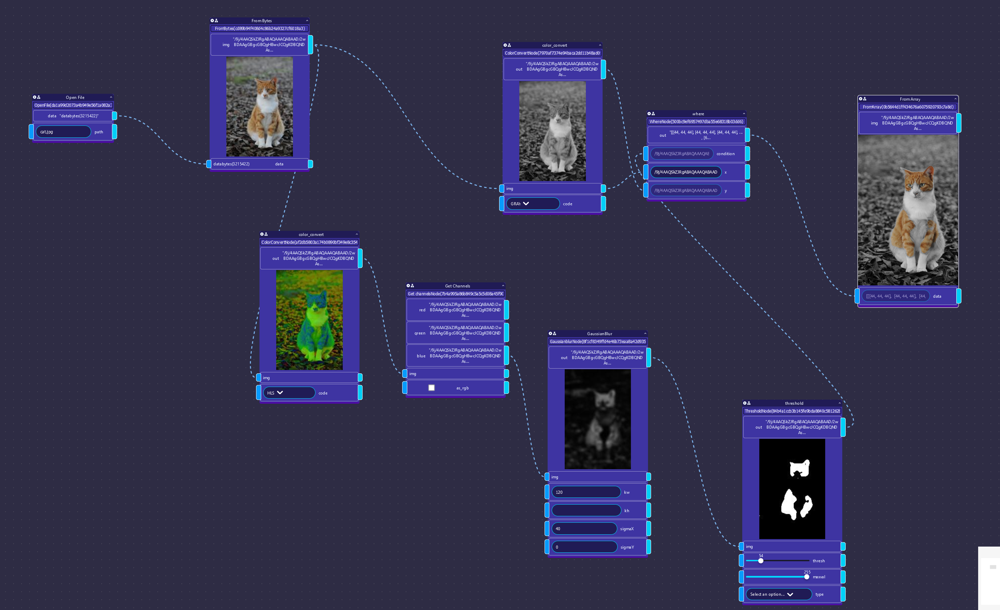
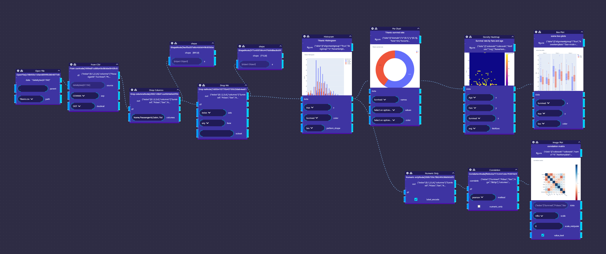

!!!info "Pyodide examples"

    This page contains examples of using Funcnodes within Pyodide. Since all runs in your browser and python has to be compiled to WebAssembly on each page load, the examples might take a few seconds to load and the execution might be slower than on a native python installation.

### [Reading csv](csv.md)

This example a simle csv data is read and analyzed. The result are exported to an excel file.

### [Image Analysis](cat.md)

This example shows that Funcnodes workes with OpenCV and you can perform live image analysis in the browser.

### [Plotly](titanic.md)

This example shows how to use Plotly to create interactive plots in the browser using Funcnodes.

