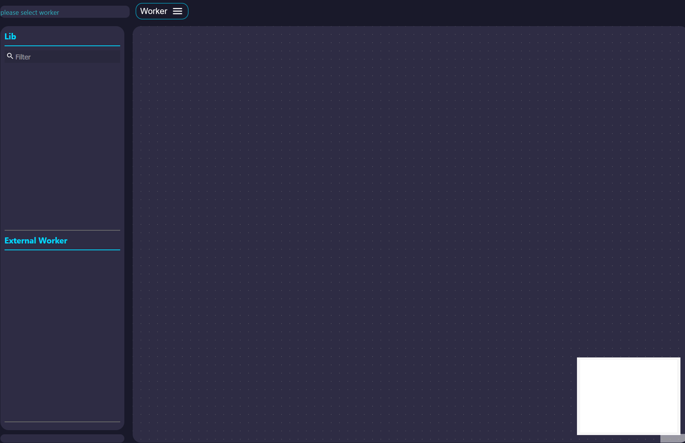
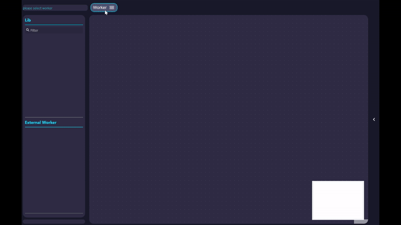
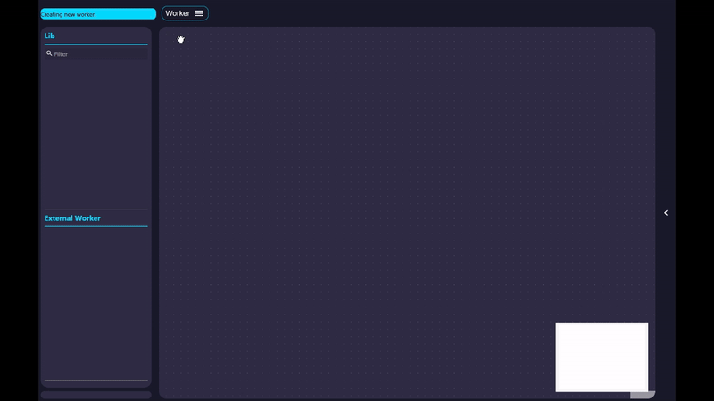
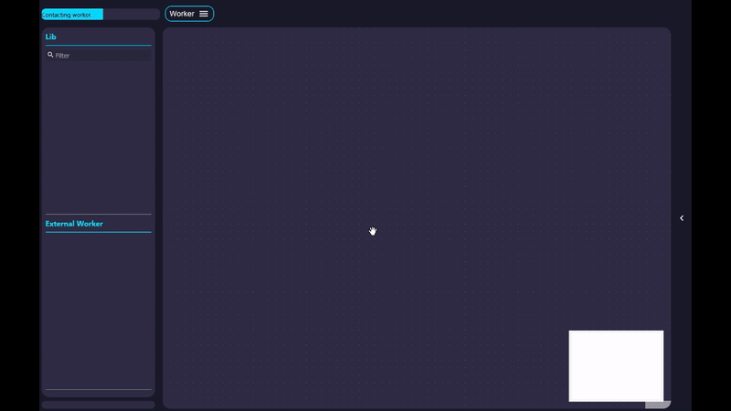
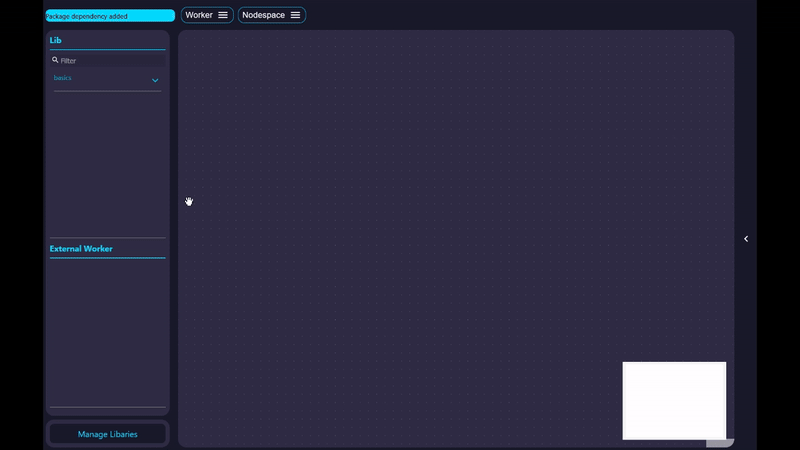

## Start the UI

The core use case of FuncNodes is to bring arbitrary complex functionalities into a node-based no-code interface.

To start the UI simply call:

```bash
funcnodes runserver # (1)!
```

1. For more options see the [CLI options](../api/cli.md#runserver)

This will spawn a browser window with the basic FuncNodes Interface:


## First Worker

### Create Worker

[Workers](../components/worker.md) are basically individuall programms that live within the FuncNodes framework.
They are usually running completely seperated from each other and contain the necessary modules and the current state of the complete workflow.

To create a new worker simply click on the `Worker` menu → `New`, enter a name and click `Create`.
This will create a new Worker with the given name in the Worker directory (default `~/.funcnodes/worker`) and also set up the virtual environment for the Worker.


### Run Worker

To start the newly created Worker click on the worker name under `Worker` → `select`.
You can see that the worker is active if the `Nodespace` header menu and the `Manage Libraries`



### Add Functionalities

FuncNodes provides its functionalities in the form of Nodes. These nodes are shipped as normal python packages with a specific layout and entry points for auto detection.

The UI currently grabs a list of available modules from our [managed repository list](https://github.com/Linkdlab/funcnodes_repositories){target="\_blank"} and shows them under `Manage Libraries`

If you click on `Manage Libraries` a window opens that shows you a List of:

- Installed modules, that are not used by the worker
- Installable modules
- Modules that are currently used by the Worker

New modules can simply added via the `Add` button



If a new module is added its [Shelf](../components/shelf.md) becomes available in the `Lib` menu

### Adding and working with Nodes

[Nodes](../components/node.md) are the core components of Func**Nodes** and are the simples computing unit in the framework and are basically functions with [Inputs](../components/nodeinput.md) and [Outputs](../components/nodeoutput.md).
Inputs can be either connected to other node's outputs or set manually (if the underlying datatype allows it).

Nodes can be added from the Library by selecting the specific shelf (and sub-shelf) or searched via the search bar in the lib.
By double-clicking the name of the Node a new Instance is added to the [Nodespace](../components/nodespace.md) in the center.



Ones a Node is created its inputs can be set and the outputs can be connected to the inputs of other Nodes.
Ones the input of a Node changes it is triggered and the created outputs are passed to connected inputs.

If you hover over inputs and outputs its current value is shown, allowing for live feedback.

To highlight what you can really do with FuncNodes plase head to the [Examples](../examples/index.md)
